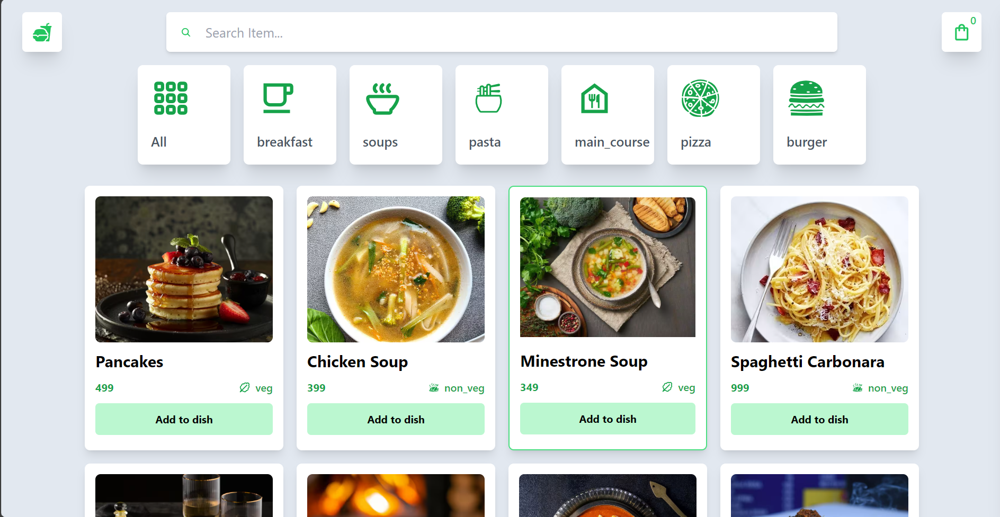

<div align="center">
  <h2>Food Delivery Website Using React JS</h2>
</div>

## Table of contents

- [Overview](#overview)
  - [The challenge](#the-challenge)
  - [Screenshot](#screenshot)
- [My process](#my-process)
  - [Built with](#built-with)
  - [What I learned](#what-i-learned)
- [How to build](#How-to-Build)
- [Author](#author)

## Overview

### The challenge

Building a modern, user-friendly food ordering website using ReactJS and Tailwind CSS without a backend. The main goal was to create a responsive and visually appealing UI that allows users to browse different categories of food items and add them to their cart.

### Screenshot



## My process

### Built with

- React JS
- Tailwind CSS
- Mobile-first workflow

### What I learned

During the development of this project, I gained valuable experience in:

- Strengthening my ReactJS skills, including component structuring and state management.
- Enhancing UI design using Tailwind CSS for a modern and consistent look.
- Implementing filtering and search functionalities using React state and hooks.
- Deploying a frontend-only application efficiently.

## How to Build

If you want to build this project, follow these steps:

### 1. Clone the repository:

```sh
git clone https://github.com/trucanh21/Food-Delivery-Website-Using-React-JS.git
cd your-repository
```

### 2. Install dependencies:

```sh
npm install
```

### 3. Start the development server:

```sh
npm run dev
```

This will start the app in development mode.

## Author

- Website - [Lan Ta](https://github.com/trucanh21)
